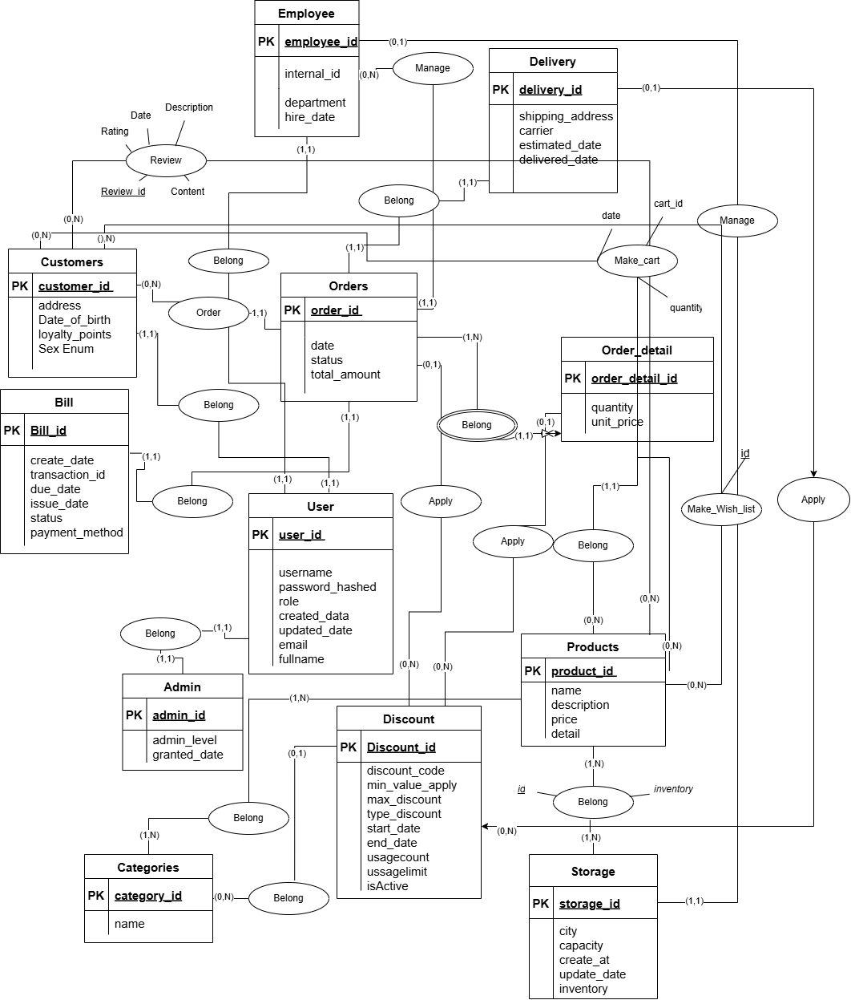
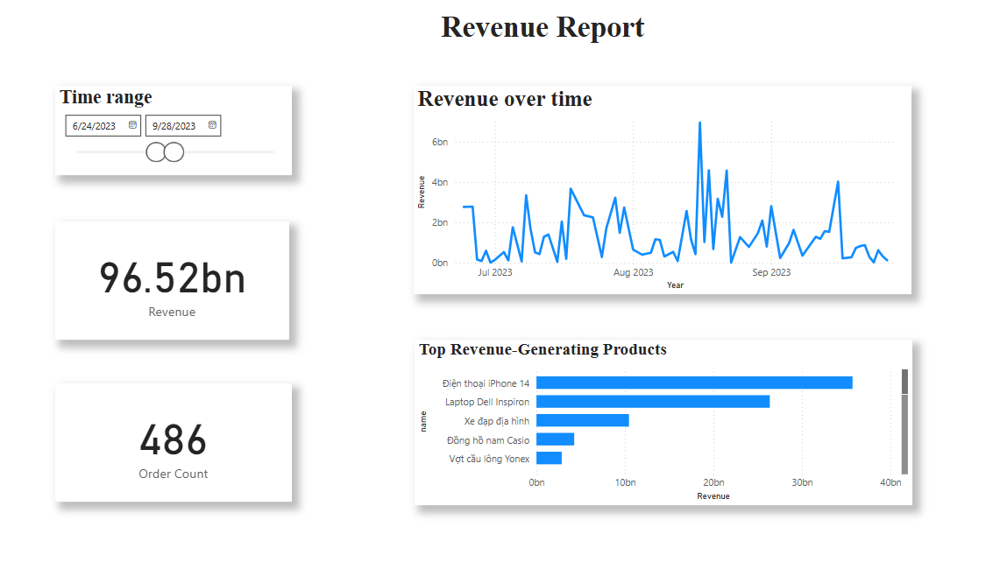
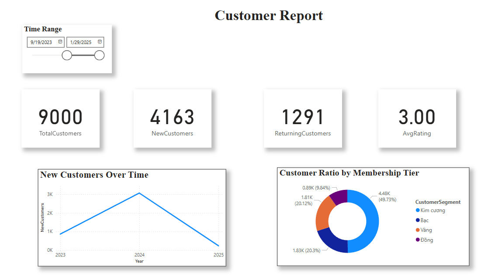
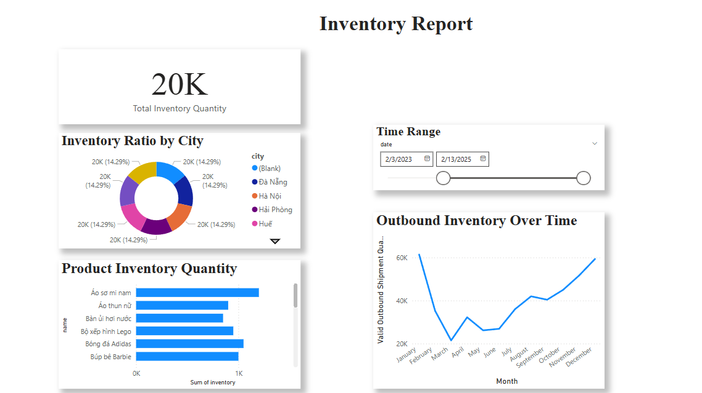

# azure-ecommerce-DB

Academic group project (IE103) : **E-Commerce database system** on Azure with **MySQL** backend, **Redis cache** for performance, **PowerBI** dashboards, and **Figma** design mockups.  
⚠️ This project is **archived** (Azure server has been shut down). Repo keeps **SQL scripts, Redis integration code, and documentation** for reference.

---

## 📌 Overview

This project was developed as a course assignment to design and implement an **online shop database system** with focus on:

- **Relational database (MySQL)**: schema, functions, procedures, triggers, and views  
- **Caching (Redis)**: session, cart, trending products. Avoid data loss due to server crash.   
- **Deployment (Azure)**: Azure Database for MySQL & Azure Cache for Redis  
- **Analytics (PowerBI)**: dashboards for business insights  
- **Design (Figma)**: UI/UX mockups  

---

## 🖼️ Architecture
The system integrates multiple technologies to support an **E-Commerce platform**:

- **Azure MySQL Database**: main relational database storing users, products, orders, payments…
- **Azure Cache for Redis**: Redis is used as a **caching layer** to improve performance and reduce load on MySQL
- **Python Scripts** (`src/redis_mysql/`): connect MySQL + Redis, handle caching logic
- **PowerBI**: visualize business KPIs (revenue, customers, inventory) from MySQL data
- **Figma**: design UI/UX prototypes for the front-end
- **Azure Deployment**: cloud hosting for DB and cache

### Architecture Diagram
```
[User]
│
▼
[Frontend (Figma Prototype/Web)]
│
▼
[Backend (Python API - demo scripts)]
│
├──► [Azure MySQL Database] (persistent storage)
│
└──► [Azure Redis Cache] (sessions, cart, hot products)

[PowerBI] ◄── [MySQL Database] (reporting & analytics)
```
*(diagram simplified for illustration)*

---

### 🔹 Data Flow
1. **User actions** (login, add to cart, place order) → API (Python scripts).  
2. API checks **Redis cache** first (for fast response).  
3. If cache miss → query **MySQL**, return data, and update Redis.  
4. **PowerBI** connects to MySQL for business reports (Revenue, Customer, Inventory).  
5. **Figma prototypes** illustrate how the UI/UX would interact with the system.


### ERD (Entity-Relationship Diagram)


---

## 📂 Repository Structure
```
.
├─ docs/                    # Reports, diagrams
│  ├─ Final_report.pdf
│  ├─ ERD.png
│  └─ ...
│
├─ sql/                     # SQL scripts
│  ├─ schema/              # create_table, FK, indexes
│  ├─ seed/                # sample data
│  ├─ Functions/
│  ├─ Procedures/
│  ├─ Triggers/
│  └─ Views/
│
├─ src/redis_mysql/        # Python scripts for Redis + MySQL integration
│  ├─ Cart.py
│  ├─ Trending_products.py
│  ├─ Remaining_login.py
│  ├─ connect_close_db.py
│  ├─ DigiCertGlobalRootG2.crt.pem
│  └─ __pycache__/
│
└─ design/                 # UI mockups (Figma), PowerBI dashboards
   ├─ Figma/
   └─ powerBI/
```

## 📈 Business Intelligence Analysis (PowerBI)

This project includes **PowerBI reports** to visualize key metrics for the E-Commerce database.

- Full interactive report: [`Report.pbix`](design/powerBI/Report.pbix)

### Dashboards

#### 1. Revenue Report


#### 2. Customer Report


#### 3. Inventory Report


